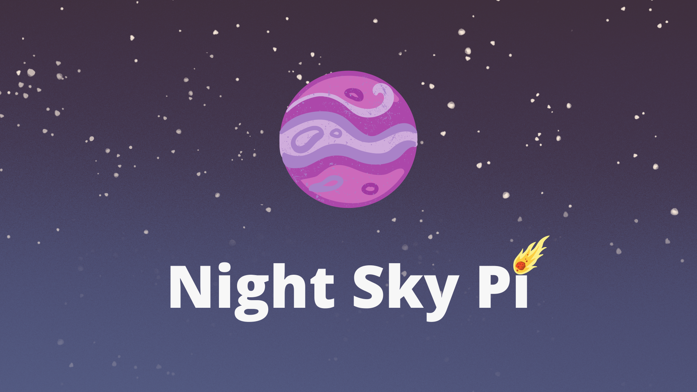

# Night Sky Pi

  

## Table of Contents

- [Description](#description)
- [How To Use](#how-to-use)
- [References](#references)
- [License](#license)
- [Author Info](#author-info)

---

## Description

## Technologies

[Back To The Top](#night-sky-pi)

---

## How To Use

[Back To The Top](#night-sky-pi)

---

## Roadmap

[Back To The Top](#night-sky-pi)

---

## References

[Back To The Top](#night-sky-pi)

---

## License

Copyright (c) 2022 Joseph McCarthy

Permission is hereby granted, free of charge, to any person obtaining a copy
of this software and associated documentation files (the "Software"), to deal
in the Software without restriction, including without limitation the rights
to use, copy, modify, merge, publish, distribute, sublicense, and/or sell
copies of the Software, and to permit persons to whom the Software is
furnished to do so, subject to the following conditions:

The above copyright notice and this permission notice shall be included in all
copies or substantial portions of the Software.

THE SOFTWARE IS PROVIDED "AS IS", WITHOUT WARRANTY OF ANY KIND,
EXPRESS OR IMPLIED, INCLUDING BUT NOT LIMITED TO THE WARRANTIES OF
MERCHANTABILITY, FITNESS FOR A PARTICULAR PURPOSE AND NONINFRINGEMENT.
IN NO EVENT SHALL THE AUTHORS OR COPYRIGHT HOLDERS BE LIABLE FOR ANY CLAIM,
DAMAGES OR OTHER LIABILITY, WHETHER IN AN ACTION OF CONTRACT, TORT OR
OTHERWISE, ARISING FROM, OUT OF OR IN CONNECTION WITH THE SOFTWARE OR THE USE
OR OTHER DEALINGS IN THE SOFTWARE.

[Back To The Top](#night-sky-pi)

---

## Author Info

- [GitHub](https://github.com/joseph-mccarthy)
- [Website](https://joseph-mccarthy.github.io/)
- [Developer Log](https://joseph-mccarthy.github.io/devlogs/night-sky-pi)

[Back To The Top](#night-sky-pi)
